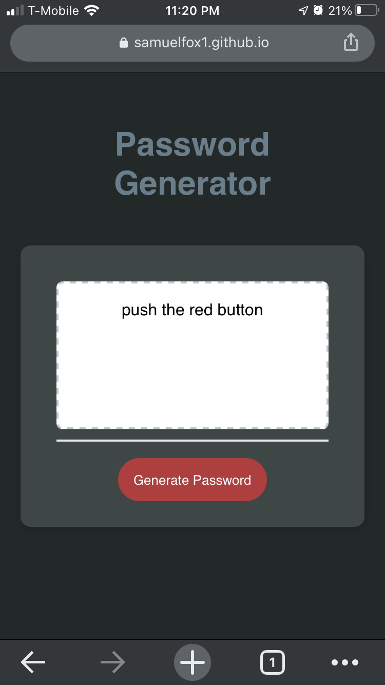
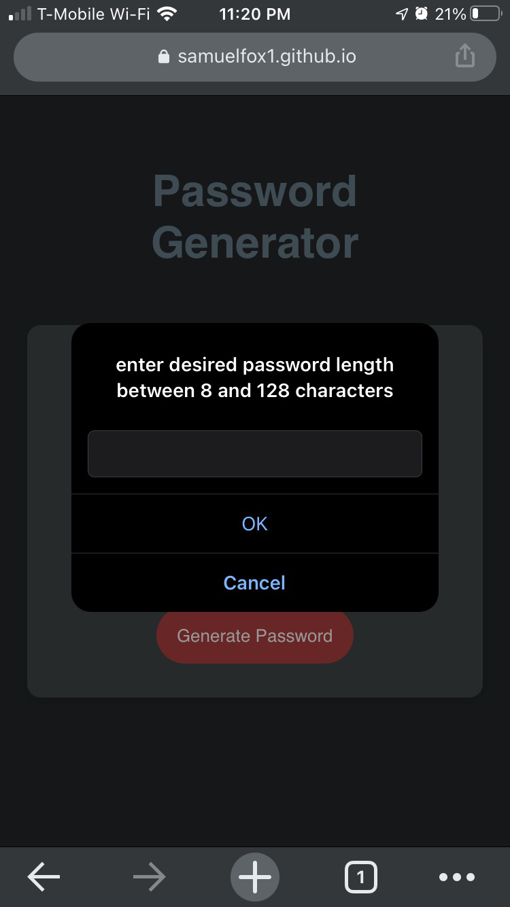
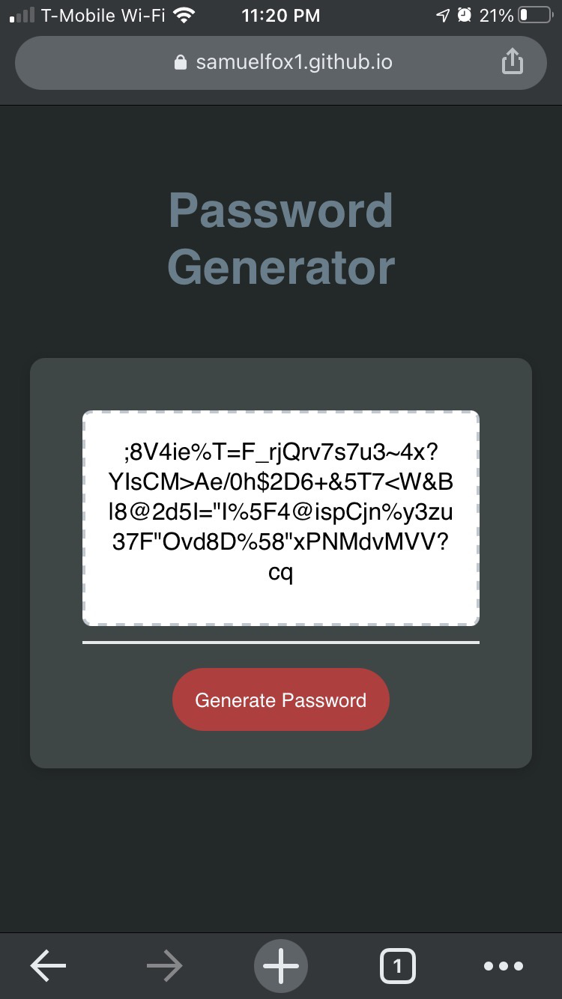

# password-generator
Built in December 2020 

****** This application is live at https://samuelfox1.github.io/password-generator/ ******

User instructions:
    1.  Click the big red button.                    
    2.  Select Password length, 8-128 characters.    
    3.  Follow the on-screen prompts.                
    4.  Choose any combination of lowercase letters, Uppercase letters, numbers, and special characters.
    5.  See your new password instantly!

This application is a fun interactive tool to generate endless high security passwords.
Just a few simple entry options and a new password will be ready in no time.
The html and starter javascript code was provided by the University of Washington Full-Stack-Flex Coding Bootcamp course.
The javascript user interaction and the character generator was build by myself, Samuel Fox.

The javascript code in this tool demonstrates my knowledge of:
    User edge cases
    User input through:
        Targeted button clicks 
        Page prompts and alerts
    Tracking the users input values and storing them for a functional use
    Variables and value types
    functions
    Building arrays and retrieving data from the indexes
    Random number generators
    if, if else, else statements
    for loops
    neat and organized code structure with detailed purposeful comments
    clearing data from a variable to reset the program to run over and over again
    utilizing a broswers dev console and logging basic program progress throughout operation

    
    