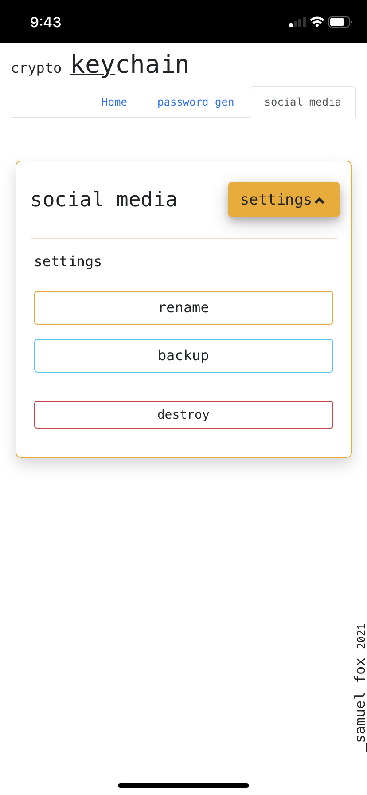

# crypto-keychain

Create custom passwords, build encrypted kechains, and generate secure backups with this all in one solution.

checkout the app [here](https://samuelfox1.github.io/crypto-keychain) 

 

## Tools & Tech

 

## Screenshots 

  
  
  
  

 

## Feature Demo

checkout the recovery feature
- use [this](https://samuelfox1.github.io/crypto-keychain?recovery=crypto_keychaincryptoKeychainU2FsdGVkX18GrfwrKHr2z9JUurBjD8Yd6Jgep0knLnPJLesCvtzPRl+GEPafXTWL6tztTvBRC8urfuW9/r+ebqPwOZSNa45SzqtGpB7hHZh01rG5yy/KhFHq8FkeyWNgRXDADC0Tw46KnMiySQg5JTloi4z4awx1bS+WzyUE5KVjK6DjitkC+CqfTuXe/fzABVmcfoJCt7HG7q+5FnONk+0Nq61m78sGBXk7t673X6nFn+saxWFKZLD6dOHKZtXBlFYCjI6iugpAjBdyVxIVdu9zklpxmvNPgaNCH6ZYal7ht3QViQfftCVTbKyuCNFhDCRT0R8gIXRn30aKyYArzcPlST1PPdAf4Zj0LGDflEfDDierD9w7fVkRLb+1xH+jBHf/PS2ildr5WoLl1W3Y/OrIIYGDU8Hgjd6Dm0xGOUzQWghzFiIBMyaENNKNVDY3R+OV/NXHDtsIGHJewv4Gv8oCTem0zXXVAIPqJNZfVgky1gjnzYnHfaTMfFFkbcLZ0C8Bdh/UbIw9QeFHlKpqqg/Ny+Xy6jggBTCM/iHoYA9Zxjbzp+gB0oilZHQuCSTnMVUlEQ5jOl/Tv3be2WcK5A==) recovery link
- use password: `password`
- click 'access existing chain' to see the stored secrets

### Questions

| Name | Email  | Github  | LinkedIn |
| :--: | :----: | :-----: | :------: |
| Samuel Fox | samueljasonfox@gmail.com |  |  |

2021